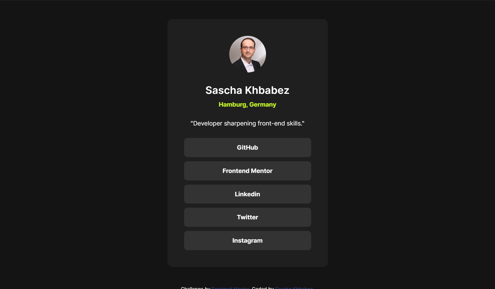
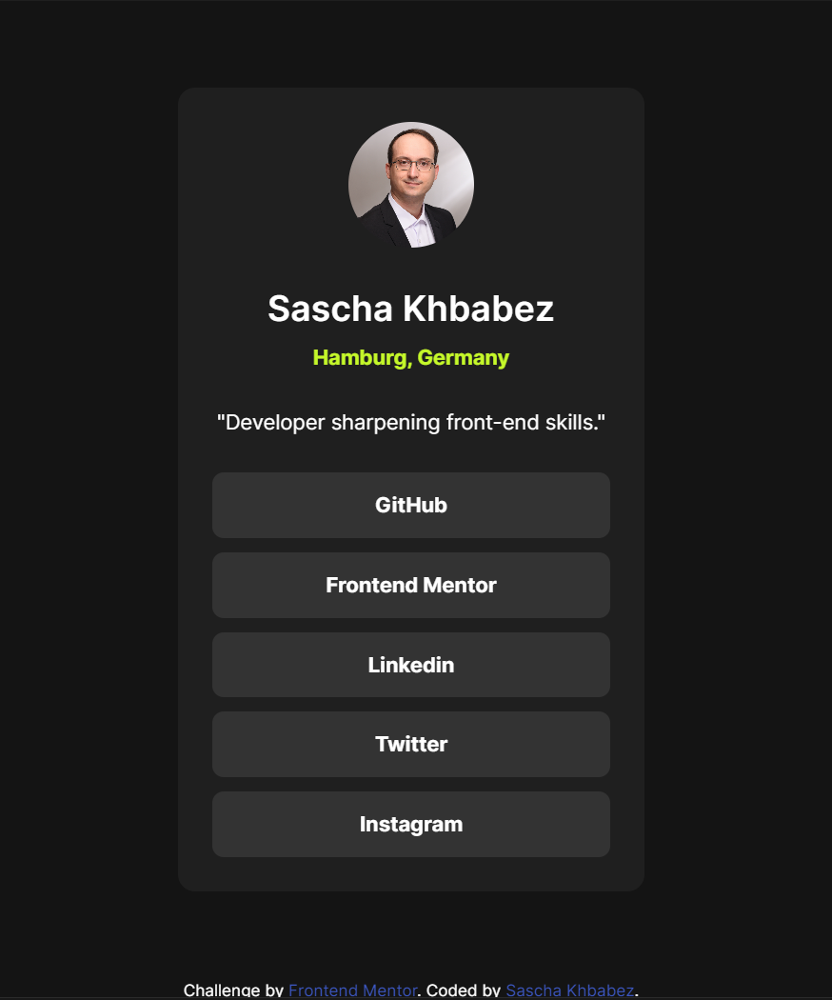
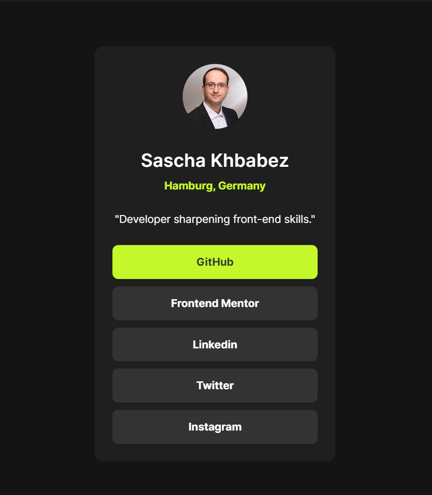

# Frontend Mentor - Social links profile solution

This is a solution to the [Social links profile challenge on Frontend Mentor](https://www.frontendmentor.io/challenges/social-links-profile-UG32l9m6dQ). Frontend Mentor challenges help you improve your coding skills by building realistic projects.

## Table of contents

- [Overview](#overview)
  - [The challenge](#the-challenge)
  - [Screenshot](#screenshot)
  - [Links](#links)
- [My process](#my-process)
  - [Built with](#built-with)
  - [What I learned](#what-i-learned)
  - [Continued development](#continued-development)
  - [Useful resources](#useful-resources)

## Overview

### The challenge

Users should be able to:

- See hover and focus states for all interactive elements on the page

### Screenshot

### Links

- Solution URL: [https://github.com/skhbabez/social-links-profile-main](https://github.com/skhbabez/social-links-profile-main)
- Live Site URL: [https://skhbabez.github.io/social-links-profile-main/](https://skhbabez.github.io/social-links-profile-main/)

## My process

### Built with

- Semantic HTML5 markup
- CSS
- Flexbox
- Mobile-first workflow

### What I learned

I reviewed responsive design again to refresh my knowledge of media queries. I also put extra effort into ensuring the page is accessible, avoiding the use of buttons for links, even though the Figma file suggested otherwise.

### Continued development

Focussing more on refreshing basics and especially responsive design.

### Useful resources

- [Media queries](https://web.dev/learn/design/media-queries?continue=https%3A%2F%2Fweb.dev%2Flearn%2Fdesign%23article-https%3A%2F%2Fweb.dev%2Flearn%2Fdesign%2Fmedia-queries) - Media query basics.
